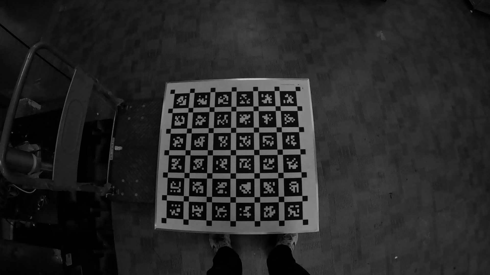
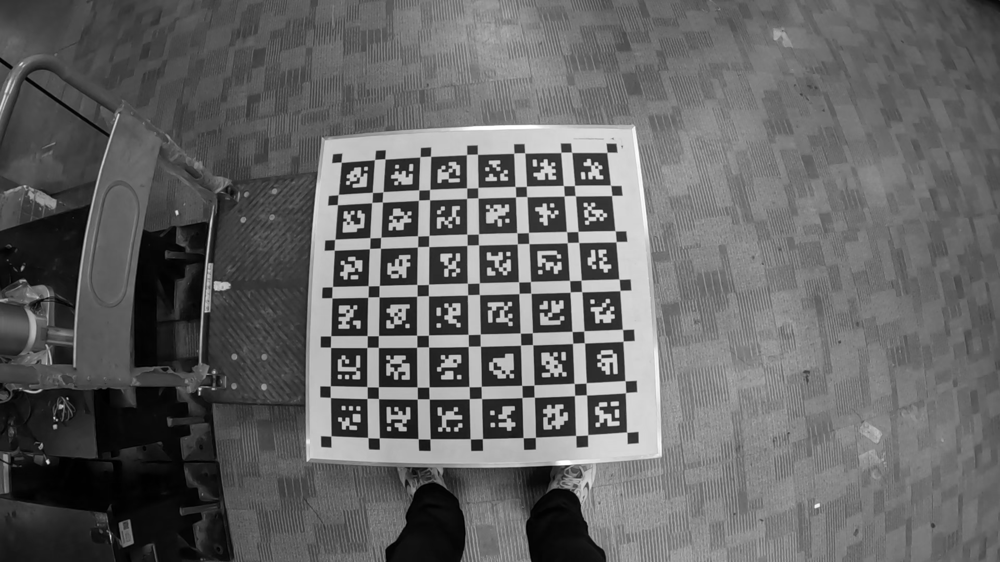

# gopro_parser
This repository contains code for parsing GoPro telemetry metadata to obtain GoPro images with synchronized IMU measurements. The GoPro visual-inertial data can then be saved in **rosbag** or **EuRoC** format. Thus, effectively paving the way for **Visual-Inertial Odometry/SLAM** for GoPro cameras.    

This repository uses GoPro's official [gpmf-parser](https://github.com/gopro/gpmf-parser) to extract metadata and time information from GoPro cameras. For detailed usage instructions, [click here](gpmf_parser/README.md).    

This repository references [gopro_ros](https://github.com/AutonomousFieldRoboticsLab/gopro_ros), but removes the ROS1 dependency and simplifies the installation process.


本仓库包含用于解析 GoPro 遥测元数据的代码,以获取带有同步 IMU 测量值的 GoPro 图像。GoPro 视觉惯性数据可以保存为 **rosbag** 或 **EuRoC** 格式。因此,这有效地为 GoPro 相机的**视觉惯性里程计/SLAM**铺平了道路。    

本仓库使用 GoPro 官方的[gpmf-parser](https://github.com/gopro/gpmf-parser)从 GoPro 相机中提取元数据和时间信息,具体使用方式[点击](gpmf_parser/README.md)

本仓库参考了[gopro_ros](https://github.com/AutonomousFieldRoboticsLab/gopro_ros),在此基础上移除了 ROS1 依赖,简化了安装过程            


## 环境配置

### 依赖
- Ubuntu 20.04 or later
- [OpenCV](https://github.com/opencv/opencv) >= 4.2
- [FFmpeg](http://ffmpeg.org/)
- [rosbags](https://ternaris.gitlab.io/rosbags/)

### 安装

```bash
# OpenCV
sudo apt install libopencv-dev

# FFmpeg
sudo apt install ffmpeg

# rosbags
pip install rosbags
```

如果你的系统是 Ubuntu 22.04, 你还需要额外安装: 
```bash
sudo apt install libavdevice-dev libavfilter-dev libpostproc-dev libavcodec-dev libavformat-dev libswresample-dev
```

## 编译
```bash 
mkdir build
cd build
cmake ..
make -j32
```

## 使用

1. 导出为 EuRoC 格式
```
Usage: ./gopro_to_euroc
    --g             : the path to the GoPro video file
    --d             : the directory to save the extracted data
    --s             : the scale to resize the image, default: 1.0
    --interval      : the interval to save images, default: 1
    --gray          : whether to save grayscale images, default: false
    --display       : whether to display images during processing, default: false
    --ignore_img    : whether to ignore images during processing, default: false
    --ignore_imu    : whether to ignore IMU data during processing, default: false
    --h             : show this help message
```
可以参考[脚本](scripts/gopro_to_euroc.sh)


2. 将 EuRoC 格式的数据转为 ros1 bag
```
usage: euroc_to_rosbag.py [-h] 
    --data_dir DATA_DIR 
    --bag_path BAG_PATH 
    [--img_interval IMG_INTERVAL]
```
可以参考[脚本](scripts/euroc_to_rosbag.sh)


## 标定建议

- 数据采集
由于 GoPro 使用的是卷帘快门, 为了降低运动变形, **在采集数据时, 一定要以非常慢的速度运动!!!**    

- 相机畸变模型
以 HERO12 为例, 如果使用窄的视野( 如: **L** ), 使用 OpenCV 的 pinhole 畸变模型 [fx,fy,cx,cy]+[k1,k2,p1,p2,[k3,[k4,k5,k6]]], 这对应于[kalibr](https://github.com/ethz-asl/kalibr/wiki/supported-models)中的`pinhole-radtan`, 如果使用宽视野( 如: **W/S**及以上 ), 推荐使用 OpenCV 的 fisheye 畸变模型 [fx,fy,cx,cy]+[k1,k2,k3,k4], 这对应于[kalibr](https://github.com/ethz-asl/kalibr/wiki/supported-models)中的`pinhole-equi`。     

- 曝光时间
建议手动设置较低的曝光时间,标准是: **刚好使标定板上的相邻两个正方形之间的顶点清晰可见(上图),又不至于因为曝光太高导致相邻两个正方形的顶点几乎发生分离(下图)**
</div>    
</div>    

